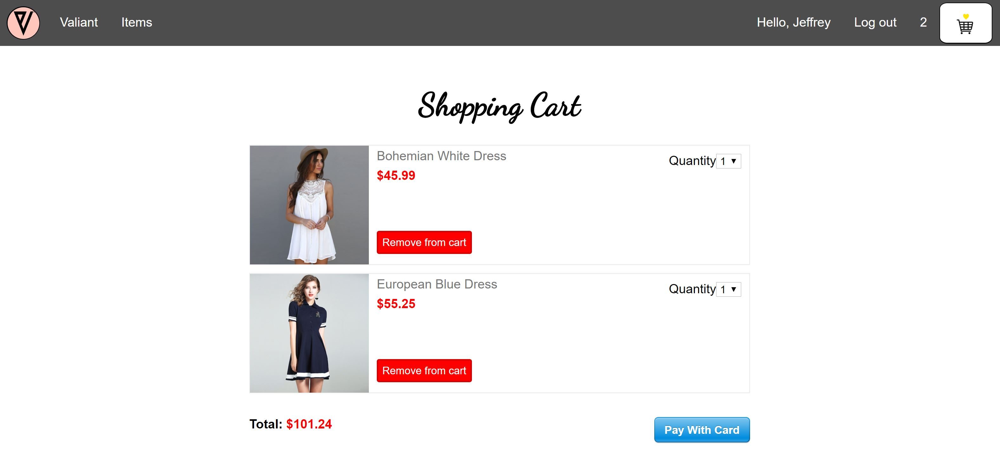
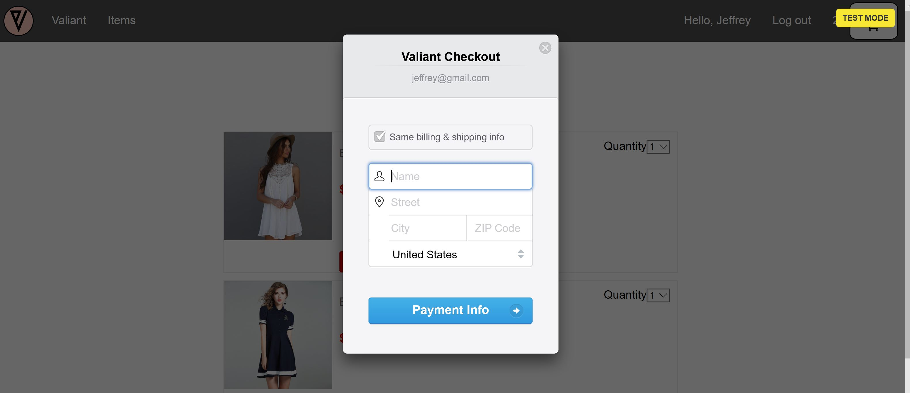

## Description 
•	Valiant is a full stack e-commerce with shopping cart functionality, real payment handling and mobile friendly.  
•	Built with React JS, React Router, Axios, Node JS/Express, Sequelize, PostgreSQL, and the Stripe API.  

## Testing Data
• Demo user: demo@gmail.com  
• password: 123456  
• Credit card: 4242 4242 4242 4242  
• Any other data related to the credit card can be random. 
## My contribution 
Developed this application in collaboration with Asifa Khan.  

### What I worked on:  
•  Managed the state of the entire application. In addition, I added state and interactivity to the stateless components created by Asifa.  
•  Implemented the shopping cart functionality.  
•  Implemented real payment handling using the Stripe API.  
•  Implemented user authentication.  
•  Wrote all the server side code. For instance, I created the end points, the data base, the data base tables, models, etc.    
•  Connected the front-end with the back-end.   
•  Deployed the front-end to Netlify and the back-end to Heroku.

## Server side code
https://github.com/Jeffrey-A/eCommerceServer  

## Home 
  

## Products
  

## Cart

## Payments

